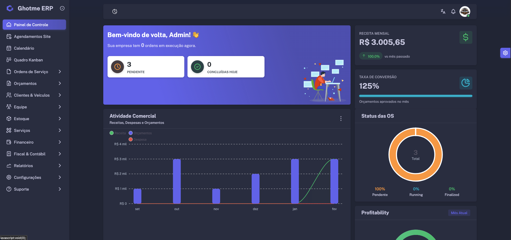
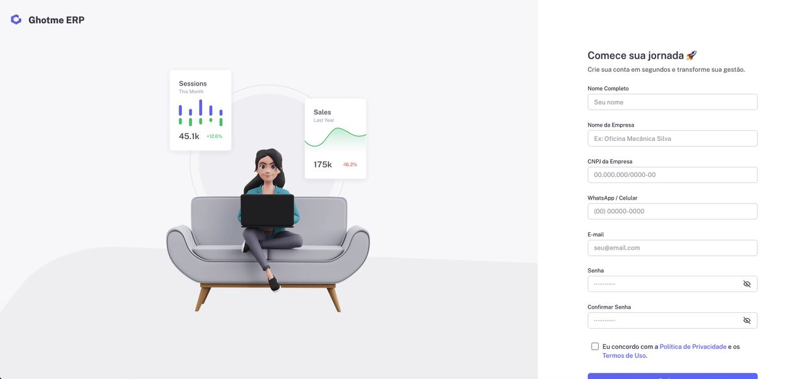

# Ghotme ERP

**A multi-tenant SaaS platform for service businesses**, built to serve multiple verticals — auto workshops, pet clinics, electronics repair shops, beauty clinics, construction — from a single codebase, with a Laravel web app and a companion React Native mobile app.

> This is a **case study repository**. Ghotme ERP is a commercial product, so the production source is closed. This repo documents the architecture, technical decisions, and highlights of the system I designed and built.

      

## Screenshots

**Web dashboard (dark mode)**

**Onboarding / signup**

**Real-time support chat**

| Mobile dashboard | Mobile service order detail |
|---|---|
|  |  |

_All data shown is seeded/demo data, not real customer information._

## The problem it solves

Small and mid-size service businesses (workshops, clinics, repair shops) usually cobble together spreadsheets, WhatsApp, and generic tools to manage service orders, stock, and billing. Ghotme ERP gives them one system — service order lifecycle, inventory, invoicing (including Brazilian NFe tax compliance), payments, and a mobile app — configured for their specific industry out of the box.

## Architecture highlights

**Multi-tenancy (dual-database)**
Each company gets its own database, with a separate landlord database holding tenant/plan metadata. A `TenantManager` service resolves the tenant from the authenticated user at request time and switches the active database connection dynamically; a `TenantCreator` service provisions new tenant databases on signup.

**Multi-niche engine**
One codebase serves five different verticals (automotive, pet, electronics, beauty clinic, construction) by translating labels, icons, and seed data at runtime rather than forking the code per industry. A niche helper exposes `niche_translate()`, which swaps canonical terms ("Vehicle" → "Pet", "Workshop" → "Clinic", etc.) throughout the UI, and a dedicated initializer service seeds industry-appropriate default services/checklists when a company is created.

**Service-layer separation**
Business logic is isolated from controllers/Livewire components into dedicated services, including:
- Service order lifecycle management
- Payment processing (Asaas gateway integration)
- Brazilian NFe fiscal invoice generation
- Automatic stock deduction on service completion
- An AI support assistant (Claude API) that can answer questions and take actions inside the app

**Real-time features**
Chat and notifications are pushed live via Laravel Reverb/Pusher and Laravel Echo, both on web and mobile.

## Mobile app

The companion mobile app (React Native + Expo Router) mirrors the web app's tenant/niche-aware experience: file-based routing, Sanctum token auth, and a set of React contexts for auth, niche configuration, theming, language, and device state. It also ships a small watchOS companion app.

## Tech stack

| Layer | Technology |
|---|---|
| Backend | PHP, Laravel |
| Frontend (web) | Livewire 3, Bootstrap 5 (Vuexy template), Vite |
| Mobile | React Native, Expo Router, Swift (watchOS) |
| Realtime | Laravel Reverb / Pusher, Laravel Echo |
| Database | MySQL (multi-tenant: landlord + per-company databases) |
| Integrations | Asaas (payments), Brazilian NFe (tax invoicing), Claude API (AI assistant) |
| Infra | AWS |

## My role

I designed and built the entire system solo — from the multi-tenant/multi-niche architecture to the Laravel backend, the mobile app, and the AWS deployment pipeline.

## About me

PHP & Laravel specialist based in Curitiba, Brazil, currently working toward relocating to Canada. See my [GitHub profile](https://github.com/Matheus-voltz) for more.
